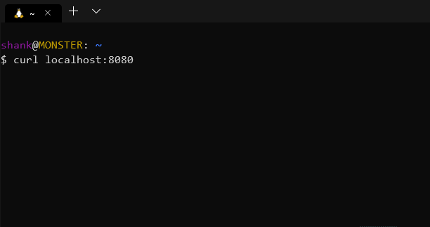

# ASCII Player

Stream ASCII video over HTTP, terminal.



## Usage

```sh
# terminal 1
go run main.go

# terminal 2
curl localhost:8080
```

## Ref

* [www.asciimation.co.nz](http://www.asciimation.co.nz/)
* [nitram509/ascii-telnet-server](https://github.com/nitram509/ascii-telnet-server)
* [martinraison/ascii-tv](https://github.com/martinraison/ascii-tv)
